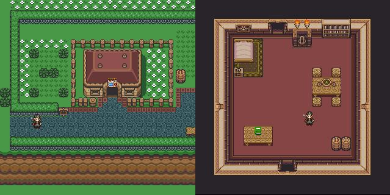



## Zelda Style Adventure Game \(Update\)

### Description

A ZeldaStyle Game that is in the works...in DirectX7. So far the mapping is almost complete, messaging is done and animation is about done. Soon to come are NPC's and fighting. Before running the game make sure u copy the font that is included and paste it in your C:\WINDOWS\FONTS folder.

You move the character using the arrow keys, and interact with the signposts etc...using "Enter."

Also...since i am not allowed to upload Binary files...go here http://www.geocities.com/danny33156/FreeImage.zip and place that .DLL in the same folder as the .exe . Have fun!
 
### More Info
 
Please copy and paste the font file included with the zip to your C:\WINDOWS\FONTS folder in order for the game to work...thanks

             |
---                |---
**Submitted On**   |2005-05-11 20:58:28
**By**             |[Jose Diaz](https://github.com/Planet-Source-Code/PSCIndex/blob/master/ByAuthor/jose-diaz.md)
**Level**          |Advanced
**User Rating**    |5.0 (65 globes from 13 users)
**Compatibility**  |VB 6\.0
**Category**       |[Games](https://github.com/Planet-Source-Code/PSCIndex/blob/master/ByCategory/games__1-38.md)
**World**          |[Visual Basic](https://github.com/Planet-Source-Code/PSCIndex/blob/master/ByWorld/visual-basic.md)
**Archive File**   |[Zelda\_Styl1887615122005\.zip](https://github.com/Planet-Source-Code/jose-diaz-zelda-style-adventure-game-update__1-60509/archive/master.zip)

